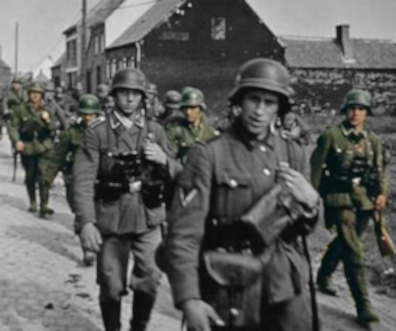

===============================================================================
`SCP-8900-EX <http://www.scp-wiki.net/scp-8900-ex>`_
===============================================================================

..  role:: raw-html(raw)
    :format: html

**項目編號** ：SCP-8900-EX

**項目等級** ：Keter

:raw-html:`<s><b>特殊收容措施</b>：由於其極難被收容的特性，SCP-8900 已被指定為 Keter 級。事實上它目前似乎無法被收容。</s>`

:raw-html:`<s>被 SCP-8900 影響的人員以及物體都將立刻被隔離並焚毀。焚燒過程中的火焰需在完全黑暗的真空中撲滅，以壓制其傳染性。任何情況下，基金會成員都不可接觸被 SCP-8900 影響的人員以及物體。</s>`

:raw-html:`<s><b>附件 8900-1</b>：已發現完全黑暗的環境能有效的抑制 SCP-8900 的擴散。特工 Harker 以及 Miriam 將被拘留並保留以研究。</s>`

:raw-html:`<s><b>描述</b>：SCP-8900 是一個複雜的知覺現象，似乎透過接觸傳播影響可見光譜。它能夠被先進的攝影技術拍攝下來，但針對異常現象的攝影會使它擴散得更快。</s>`

:raw-html:`<s>SCP-8900 是一個複雜的知覺現象，似乎透過接觸傳播影響可見光譜。它能夠被先進的攝影技術拍攝下來，但針對異常現象的攝影會使它擴散得更快。</s>`

:raw-html:`<s>SCP-8900 目前無法被收容，而且理論上也無法被收容。它從 1800 年代中後期開始出現，但當時只出現在銀板上，並不會擴散。值得注意的是，這些照片中 SCP-8900 的出現，似乎就是照相技術的〔資料修改〕。我們今日所知的 SCP-8900 似乎是在 1935 年左右產生，可能是來自 █████ 公司對「integral tripack」技術的實驗</s>`

    SCP-8900 於〔資料修改〕影響數名美國士兵

**附件 8900-2** ：:raw-html:`
`
:raw-html:`
[來自 O5-8 的辦公桌]
`

*各位，我們失敗了。SCP-8900 的影響已經進入每個角落。自然的藍天已經被噁心又不自然的陰影取代，樹木的綠色也同樣的被汙染了。SCP-8900 已經超越我們，破壞了整個可見光譜*

*我們嘗試製造一個的反向「感染」也同樣失敗了。雖然我們成功的恢復了測試物體的自然顏色，但這卻會讓它們失去反應，然後現在有個人跑來我的辦公室，告訴我這個小實驗已經突破收容。以後特工們可能會因為它保留自己的顏色而把它當成一個 SCP 物體處理。*

*我們只剩下一個選擇，各位。我要啟動基金會的最終保險，「倦怠協定」。*

*當你們收到這個訊息的時候，基金會已經在全球規模釋放巨量的 ENUI-5 化合物，我們所擁有最精巧的記憶刪除劑。全世界，那些本不該承受這種恐怖遭遇的人們，將會暫停一下下、困惑、然後回到他們自己的事，並相信一切本來就是這個樣貌，對自己已經失去了什麼全然不知。只有未被 SCP-8900 汙染的照片能留下來訴說真相。我很後悔，各位，我深深的後悔。*

*但這是必須的。*

-- O5-8

*安全、收容、保護。*

:raw-html:`
`

--------

`SCP 列表 <index.rst>`_
