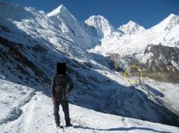

==============================================================
`事故紀錄 096-1-A <http://www.scp-wiki.net/incident-096-1-a>`_
==============================================================

SCP-096_ > 事故紀錄 096-1-A

*「所以收容已經建立了嗎？」*

*「是的，博士。」*

*「讓我看看保全錄影。」*

  **<紀錄開始>**

  *一個大型的鋼製方塊在研究室的正中央，研究室中被好幾打的研究員裝滿。視野中有一個控制室，顯示著方塊內各種感測器的讀數。*

  〔快轉 1 分 32 秒〕

  控制室的操作員傾身向前，注意到感測器的讀數不正常。大約 5 秒鐘之後，收容方塊的其中一面鋼牆出現了一個相當大的突起。突起在被擊破前變得更大。SCP-096 正掰開鋼板，狂暴的嘗試逃脫。應急鋼板罩到方塊上，收容突破的警鈴響起。

  〔保全影帶中 SCP-096 臉部依照收容程序做了模擬處理〕

  兩組安全小隊在 SCP-096 突破收容時進入了房間。實彈以及鎮靜劑飛鏢都沒有可見的效果。大約有 90% 的研究員和安全人員已經直接看到 SCP-096 的臉，Lima 代號被啟動。該房間以及鄰近的區域被封鎖，灌入 ██ 級神經毒氣。

  大約 2 分鐘後，SCP-096 突破研究站點 ██ 並且以每小時 ██ 公里的速度穿越外面的沙漠，經過 ████。

  **<紀錄結束>**

*「Echo Romeo-Actual 小隊被派往處理緊急收容突破。當我們了解到我們遇到的是多嚴重的事件時，我們完全無法應付。真可笑，這些世界上最聰明的腦袋竟然如此措手不及。」*

*「你是說這是你的錯嗎？」*

*「絕對不是。這是對 SCP-096 行為的新發現。我們無法得知，幸好這沒有演變成一個 XK 級事件。」*

  **<紀錄開始>**

  **來自 ER-A 5 的 HelmCAM 錄影**

  〔UH-60 內的攝影機顯示 SCP-096 在沙漠上以非常快的速度前進。〕

  ER-A 1：這裡是 Echo Romeo-Actual。我們看到目標了！〔無法辨識的雜音〕...速度〔資料刪除〕節，而且還在增加！

  *ER-A 1 聽著無線電中的指令（被辨識為來自 Dan 博士）。可以看到 SCP-096 的速度慢慢的增加。*

  ER-A 1 離開了攝影機的視野。ER-A 3 出現，拿著一架改裝過的 XM500 反器材步槍。兩發子彈擊發；第一發射偏了，第二發擊中 SCP-096 的小腿。SCP-096 絆倒，但又恢復了。行進速度沒有明顯改變。

  ER-A 1：〔無法辨識〕...覆，對目標沒有效果！

  *ER-A 1 再次向 ER-A 3 示意。ER-A 3 射擊了三發子彈；前兩發射偏了，第三發射進了 SCP-096 的頭部，SCP-096 倒地，滑行，翻滾了數圈，速度稍微降低。SCP-096 站起，繼續前進，勢頭不減。*

  *鏡頭往上移動，看見 8 架 V-22 魚鷹式傾轉旋翼機（隸屬於機動特遣隊 Tau-1）從上空飛過，飛過直升機，往 SCP-096 離開的方向前進。攝影機畫面切斷。*

  **<紀錄結束>**

..

  **<紀錄開始>**

  採訪影像紀錄 096-1-A

  〔Oleksei 博士表現得非常冷靜且堅定，緩慢且謹慎的回答所有問題。〕

  **採訪者** ：在收容突破的時候，你的準確位置在哪裡？

  **Oleksei 博士** ：在休息，正在準備咖啡。我沒有被關在收容區域完全是運氣好。

  **採訪者** ：描述你在收容突破剛被之後的行動。

  **Oleksei 博士** ：我派出 Echo Romeo-Actual 追蹤 SCP-096，並且向 Dan 博士報告了情況。之後我們開始定位 SCP-096-1。在 SCP-096 大致的方向確定以後，我送出了特遣隊 Tau-1 去 SCP-096 的路徑上提前清空平民。全都依照收容程序進行。

  **<紀錄結束>**

..

  **<紀錄開始>**

  採訪影像紀錄 096-1-B

  〔Daniel █████ 博士耐心的坐著。在他面前的桌上放著一個外觀類似改裝護目鏡的物品。〕

  **採訪者** ：為了記錄，SCP-096 收容突破的時候你的準確位置在哪裡？

  **Dan 博士** ：在〔資料刪除〕山脈，試著找出 SCP-096 來源的更多資訊。那是個短期的研究考察，所以我讓 Oleksei 負責管理收容。他的能力足夠，只是有點...熱切，他也在過去證明了他的能力。這些都有文件可以證實，所以請不要認為-

  **採訪者** ：只是做個記錄而已，博士。現在，在知道 SCP-096 在狂暴狀態下對任何已知形式的傷害免疫的狀況下，為什麼你還下令讓緊急應變小隊進行狙擊呢？

  **Dan 博士** ：為什麼不呢？如果有任何機會能讓 SCP-096 慢下來，為特遣隊 Tau-1 爭取更多時間，我們就得去試試。這個舉動沒有讓 ER-A 陷入危險，而直升機快要追不上它了。說真的，ER-A 幾乎沒有其他讓狀況好轉或惡化的方法。

  **採訪者** ：我了解了。現在，你可以解釋這個嗎？

  〔採訪者指向放在桌上的護目鏡〕

  **Dan 博士** ：好的。這是 SCRAMBLE 計畫，是我和 Oleksei 博士特別為 SCP-096 研發的，分配給 ER-A 和特遣隊 Tau-1。它裡面有個微處理器，不斷的分析視野內的畫面，尋找 SCP-096 的臉部特徵。裡面的臉部辨識軟體會辨識到它以後，在光線到達眼睛前把那部份的影像弄成無法辨識的一團。這真的很精巧。

  **採訪者** ：而且昂貴。

  **Dan 博士** ：非常貴。這也是它沒派上用場的丟臉之處。

  **<紀錄結束>**

..

  **<紀錄開始>**

  **機動特遣隊 Tau-1 和改裝過的 EG-3 哨兵預警機（代號「Big Brother」）之間通訊的文字紀錄**

  **MTF-T-1** ：魚鷹在空中，以〔資料刪除〕向〔資料刪除〕移動。等待方向指示。

  **Big Brother** ：電子設備啟動，到達巡航高度。正在上傳 SCRAMBLE 程式到所有的攝影機系統...攝影機啟動。Big Brother 正在觀測。

  **MTF-T-1** ：目標目前的進行方向為何？

  **Big Brother** ：目標目前正往西方...位置在...該死。對，他在 I-40。我想他剛翻掉一輛卡車。嗯，行進方向是...〔資料刪除〕度偏〔資料刪除〕度。這個方向上的下一個城鎮是...〔資料刪除〕。我覺得還有幾百公里。該死...MTF，我們要求 Echo Romeo 開始淨空 I-40。我不知道目標已經砸掉多少車了。

  **MTF-T-1** ：等等。不行，Big Brother。ER-A 回報目標比他們的直升機還快。他們沒辦法超越他。

  **Big Brother** ：那讓他們去把另一條車道上的司機攔下來...我不知道有多少人已經看到那東西的臉了。

  **<紀錄結束>**

*「Tau-1 的前三組人成功的平安集合了前三個鎮上的居民。SCP-096 依序穿過這些地方，證明 SCP-096-1 不在這裡。然而，MTF-Tau 有一段影像紀錄顯示了 SCP-096-1 在〔資料刪除〕被找到，以及接下來的事故。」*

*「放吧。」*

  **<紀錄開始>**

  **來自機動特遣隊 Tau-1 第 4 小隊的 HelmCAM 錄影，城鎮〔資料刪除〕**

  *大部份的居民被集中到廣場上，全都被蒙上眼。直升機掃過城鎮。從直升機和地面人員的擴音器傳來模糊的命令。*

  **MTF-T-1（透過 TauCOM 通訊頻道和擴音器）** ：目標正在進入鄰近區域！所有單位啟動 SCRAMBLE 裝備並且開始人群控制程序！所有居民不許離開原地或是摘除眼罩！移動或是碰觸眼罩的人會被處決！重覆，所有居民-〔被攝影機視野外的尖叫聲蓋過了命令〕

  *大約從 2 公里外，可以看到 SCP-096 正翻過山頂。它試著在下坡減速但跌倒了，高速滾下山丘，撞穿幾棟房子後幾乎立刻站穩。*

  **擴音器傳出身份不明的聲音** ：〔無法辨識〕...居民不許移動！移動的人會被處決！重覆...〔無法辨識〕

  *數聲槍響，但都不是對著 SCP-096。SCP-096 停住一秒，然後衝進人群中，丟開不少人，踩過更多。人群開始四散，更多槍響。擴音器的聲音在 SCP-096 的尖叫聲下無法辨識。SCP-096 找到了 SCP-096-1，一名中年男子，攝影機拍攝到 SCP-096 抓起他，然後攝影機被一名逃跑的居民撞到，從頭盔上掉落。*

  **<紀錄結束>**

..

  **<紀錄開始>**

  **影像採訪紀錄 096-1-C**

  **Jack Wilford 少校（機動特遣隊 Tau-1 現任指揮官）** ：我當時正在和我的小隊搜查 SCP-096-1 的房子。那可憐的傢伙是個半職業的登山家，爬過 █████████。很顯然他照了張風景照，碰巧拍到了背景裡的 SCP-096。

  〔Wilford 豎起 4 隻手指強調〕

  **Wilford** ：四個像素。他媽的四個像素。我懷疑那傢伙知不知道他看到了什麼。他大概哪天看到那張照片，注意到有一小塊雪沒有顏色，然後繼續過他的那一天。

  **採訪者** ：你是怎麼發現的？

  **Wilford** ：我們的 SCRAMBLE 裝備馬上就找到它了。中尉拿到了照片，在我看到之前就帶上直升機了。在這之前那該死的怪物已經把 Big Brother 弄了下來，還撕開了〔前〕Stryker 少校的 Stryker 裝甲車。全都亂成一團。

  **採訪者** ：所以 SCRAMBLE 裝備沒有起作用嗎？

  **Wilford** ：沒起作用？這該死的 SCRAMBLE 根本就是坨屎，它害死了一整個特遣隊。你知不知道加上我只有三個人活了下來？都是因為有些鳥蛋學究想到的什麼「最先進的 SCP-096 敵意反應對策」。那些混蛋白痴明明可以往目標的頭上套個袋子就解決了但是不，我們必須用這他媽最先進的 SCRAMBLE。

  **<紀錄結束>**

    MTF-Tau 取回的照片。SCP-096 在黃色圈圈中，已被遮蓋。

..

  **<紀錄開始>**

  **Dan 博士** ：那個混蛋剛才說我什麼？

  〔Dan 博士把桌子往後挪，開始站起來〕

  **Dan 博士** ：我要讓那天殺婊子養的混蛋看看學究是幹什麼的，我要砸爛他的-〔受訪者開始破口大罵。〕

  〔兩名警衛進入房間，把 Dan 博士按回座位〕

  **採訪者** ：我們需要鎮靜劑嗎，博士？

  〔Dan 博士深呼吸並整理了他的外套〕

  **Dan 博士** ：不，不。我道歉。〔嘆氣〕SCRAMBLE 真的是個很精巧的主意。但他失敗了，因為我們沒有完全了解 SCP-096 是怎麼運作的。你看，在 SCRAMBLE 裡的晶片捕捉到 SCP-096 的臉部特徵並開始打亂它們的時候，有一瞬間，未受干擾的光線進到了視網膜。電腦很快，但沒像光那麼快。所以，有那麼一瞬間 SCP-096 的臉部影像直接進入了大腦。這甚至不需要被意識到，但很顯然這已經足夠觸發 SCP-096 的敵意反應了。

  **採訪者** ：所以，加上這張照片的報告...

  **Dan 博士** ：這是整個事故裡最令人不安的部份。你知道上一個 SCP-096-1 是在什麼時候爬山的嗎？199█ 年。那張照片掛了 ██ 年他才看到 SCP-096。由於大腦不需要知道自己正看著 SCP-096 的臉就可以觸發反應，這世界上名符其實的任何地方都可能藏著定時炸彈。有多少照片裡藏著 SCP-096，還沒被發現，等待著一雙細心的眼睛？如同我之前所說的，我要這東西，現在，就被處決。

  **<紀錄結束>**

*「只是個小問題，博士。嗯，你當時在計畫的到底是什麼？我們招募 Jack Wilford 少校的時候他可是最好的 SBS 隊員」*

*「我以前也是個 Recon 醫療兵，長官，並且曾經部屬在高加索。海軍陸戰隊比 SBS 強。」*

*「不，他們沒有。」*

*「夠了，你們兩個。繼續。」*

  **<紀錄開始>**

  **影像採訪紀錄 096-1-D**

  **一級士官長 ████（ER-A 的門槍手）** ：我把袋子套到它的頭上。

  **採訪者** ：是的，你告訴過我了。你可以告訴我當時發生了什麼嗎？

  **████** ：它...它解決了...。它坐在那，在高速公路上。剛剛毀掉一輛小型休旅車。〔受訪者沉默。〕

  **採訪者** ：然後呢？

  **████** ：我...Wes 把直升機降落；我著陸，然後給它套袋。我把袋子套到它頭上，它冷靜下來了，然後他們把它帶走。

  **採訪者** ：████？

  〔受訪者之後一直沉默，直到採訪結束。他後來在自己的宿舍被發現，用一根代用的繩子上吊自殺了。在他的拳頭中發現一個半碎的奶嘴。〕

  **<紀錄結束>**

..

  **<紀錄開始>**

  **影像紀錄 096-1-D，從「CNN」新聞台沒收的錄影帶**

  〔超肩攝影越過現場記者，第一反應人員圍著一架墜毀的飛機。〕

  **記者** ：這架似乎原為軍用的飛機上面並沒有屬於美國軍方的標誌。第一反應人員正在尋找飛航紀錄器，警方認為這架飛機墜毀的原因是駕駛艙和機身都受到嚴重破壞所導致。

  〔記者指向機身上的大洞，數名消防隊員正爬向裡面。〕

  **記者** ：醫務人員只找到三名死者，這對於需要二十名機組人員的飛機而言很不尋常。警方表示-

  〔記者被三架懸空的超級種馬直升機中斷，其中兩架著陸，隸屬於機動特遣隊 Epsilon 的小隊開始下機。〕

  **MTF-E-1** ：關掉攝影機。關掉那他媽的-

  **<紀錄結束>**

..

  **<紀錄開始>**

  **Oleksei 博士** ：所以我們結束了嗎？

  **採訪者** ：最後一個問題，博士。或者更像是一個說明。我們發現一個有趣的事實是，在研究站點 ██ 裡面並沒有休息室。也沒有咖啡。

  〔受訪者保持沉默。〕

  **採訪者** ：我們覺得你最好說點什麼。

  〔採訪影像紀錄 096-1-A 剩餘的部份被修改〕

  **<紀錄結束>**

*「我看不出這和我有什麼關係。」*

*「沒必要裝傻，博士。他全都說了。」*

*「...那麼，我想再怎麼裝都沒用了，是嗎？」*

  **音訊紀錄，O5 聽證會**

  **O5-1** ：在重新審視了你的證詞、可取得的影像紀錄，以及已故 Oleksei 博士的招供之後，O5 一致同意你應該被處決，因為你在 SCP-096 嚴重突破之中的角色-

  **Dan 博士** ：我以為你知道「顧全大局」的意思。

  **O5-1** ：不要考驗我的耐心，博士。鑑於此次事故的影響範圍和潛在的危險性，O5 同意了你處決 SCP-096 的請求。考慮到我們缺乏對 SCP-096 足夠了解的人員，處決將由你負責，在重兵守衛以及我的親自監督下執行。對你的處決則安排在那之後的某天。

  **<紀錄結束>**

*「那太可怕了，博士。你怎麼能故意-」*

*「它管用。那種事發生在大型大口中心只是時間的問題，它的臉散佈到全世界也是遲早的事。我可以殺了 096，但在那過程中我已經殺了自己。」*

--------

`SCP 列表 <index.rst>`_

..  _SCP-096: scp-096.rst
